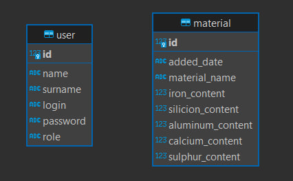
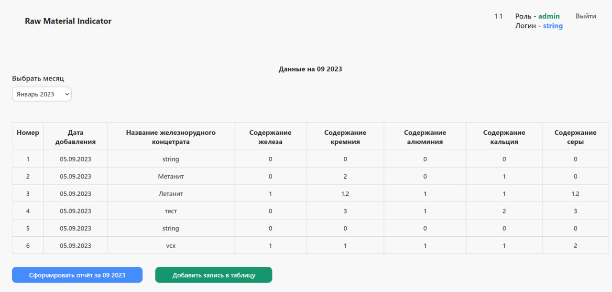
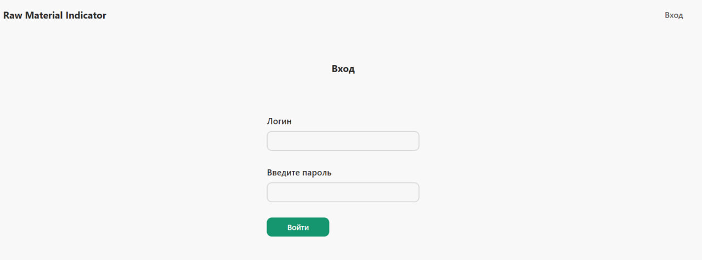
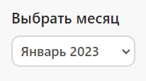
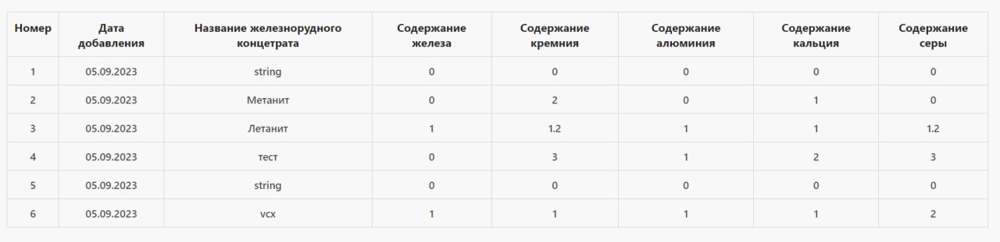
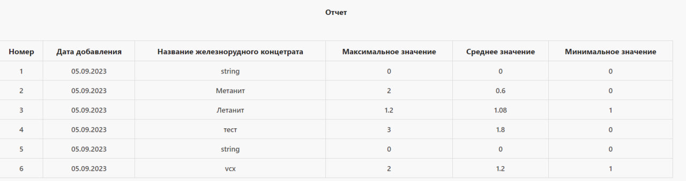
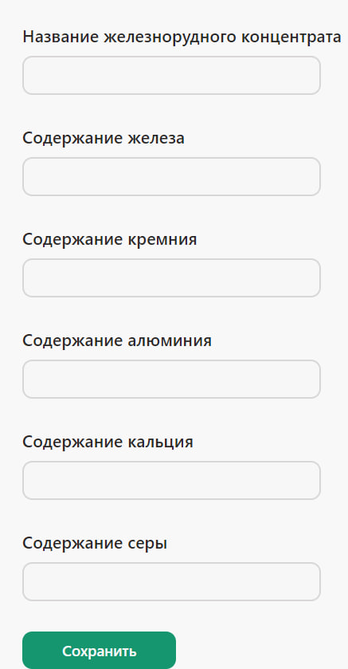

# Система добавления и просмотра данных о качественных показателях железнорудного концетрата

---

## Стэк используемых технологий:

1. **Backend**: 
   - FastAPI - фреймворк
   - TortoiseORM - для работы с PostgreSQL
   - pandas, openpyxl - для работы с excel
2. **Frontend**
   - ReactJS
3. **Database**
   - PostgreSQL

---

## Функциональность Сервера:
   
   - Все запросы можно протестировать в /docs

1. **Аутентификация и Роли Пользователей**:
   - Запрос `POST /users/login` позволяет пользователям аутентифицироваться в системе.
   - Реализована многорольевая система, где роль "admin" и "supervisor" имеет полный доступ ко всем существующим функциям. Другие роли могут ограничиваться только просмотром данных.

2. **Обновление Токена**:
   - Запрос `GET /users/refresh_token` обновляет токен пользователя, обеспечивая безопасность и безперебойную работу приложения.

3. **Добавление Новых Записей**:
   - При добавлении новой строки в таблицу Excel в папке `server/src`, данные также автоматически добавляются в базу данных PostgreSQL для резрвного копирования через запрос `POST /materials/add`. Это снижает ручной ввод данных и уменьшает вероятность ошибок.

4. **Формирование Отчетов**:
   - С помощью запроса `GET /materials/report`, на клиентской стороне формируется таблица с отчетом на основе данных о концентратах за выбранный месяц и год.

5. **Просмотр Данных из Excel**:
   - Запрос `GET /materials/excel` предоставляет данные о концентратах за определенный месяц, с возможностью выбора месяца и года.

## Структура базы данных

 

## Функциональность Клиента:

   

1. **Login page: Аутентификация и Управление Ролями**:
   - Пользователи могут аутентифицироваться в системе и в зависимости от своей роли получать доступ к соответствующим функциям.

   

2. **Home page: Таблица**:
   - При входе в систему, на домашней странице расположена таблица с данными о концетратах за текущий месяц и год. Данные берутся по REST API. С помощью элемента управления `select` над таблицей, пользователи могут выбирать месяц, за который они хотят получить данные о концентратах

   a. 
   b. 

3. **Home page: Отчетность**:
   - При нажатии на кнопку `Сформировать отчёт за мм.гггг` (дату можно выбрать в `select`) формируется отчёт в виде таблицы.

   

4. **Home page: Добавление записей**:
   - При нажатии на кнопку `Добавить запись в таблицу` открывается форма для ввода данных.

   

---

## Запуск приложения

1. Клонируем репозиторий:

```bash
git clone https://github.com/AlekseyAmp/RawMaterials.git
```

2. Соберите контейнеры Docker:

```bash
docker-compose build
```

3. Запустите контейнеры Docker:

```bash
docker-compose up
```

---

